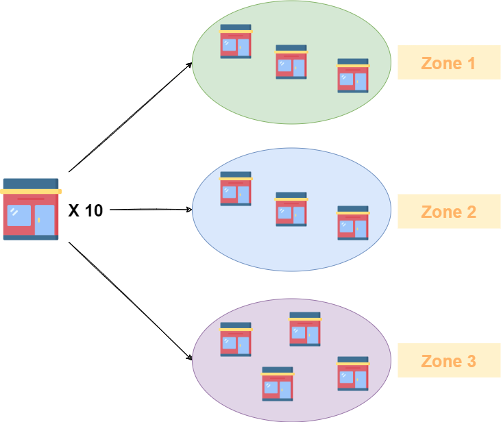
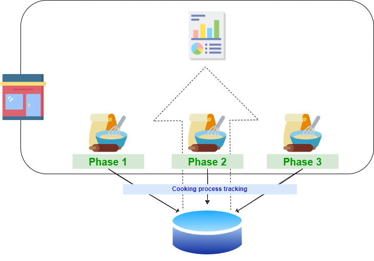
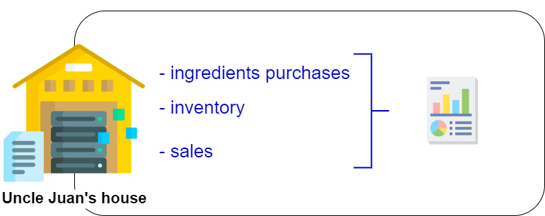
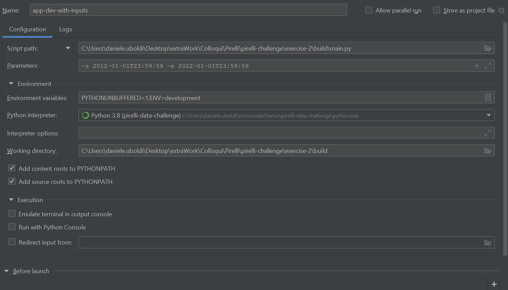

# Pirelli Data Challenge

Questo repository contiene la data challenge sottoposta da Pirelli a Novembre 2022.

- [Pirelli Data Challenge](#pirelli-data-challenge)
  - [Descrizione scenario](#descrizione-scenario)
  - [Esercizio 1](#esercizio-1)
  - [Esercizio 2](#esercizio-2)
    - [Codice](#codice)
    - [Risposta](#risposta)

## Descrizione scenario
Lo scenario è descritto all'interno del file `challenge-description/technical-challenge.pdf`. 
La situazione di partenza è riportata nelle seguenti immagini:

<center></center>

Nell'immagine precedente si può vedere un'esempio di distribuzione dei 10 store iniziali di Juan in tre zone differenti della città.

<center></center>

Sopra è riportata la situazione di partenza di ogni singolo store in cui i dati delle tre fasi di preparazione del prodotto sono raccolti all'interno di un sistema RDBMS collocato in ciascun negozio. I dati raccolti sono poi utilizzati per applicazioni locali e dashboard che consentono di monitorare l'attività.

<center></center>

Infine, nella figura sopra è possibile visualizzare il DWH centralizzato in cui vengono raccolti i dati delle vendite e dell'inventario dei singoli negozi.

## Esercizio 1

Le risposte all'esercizio 1 sono nel file `exercise-1/exercise-1.pdf`.


## Esercizio 2

### Codice

Il codice è contenuto all'interno della cartella `exercise-2/`.
Nella cartella `exercise-2/build/` è presente lo script python che elabora i dati dei file al path `exercise-2/build/src/resources/datasets` e scrive l'output finale nel file `exercise-2/build/src/resources/output/output.csv` **se e solo se** il dataframe di output calcolato non è vuoto.

L'applicazione scrive i log sul file `exercise-2/build/src/log/pirelli-data-challenge-{ENV}.log` dove `{ENV}` può essere **development** in caso di esecuzione da IDE o **local** in caso di esecuzione tramite container Docker.
La definizione di quale ambiente utilizzare è necessaria anche per definire quali siano le configurazioni dell'applicazione da caricare. Configurazioni che si trovano nel file `exercise-2/build/src/configurations/ConfigurationProperties.py`.

Per eseguire l'applicazione si hanno due possibilità quindi: 
1. tramite IDE (e.g. PyCharm) o da riga di comando
2. containerizzando l'applicazione 

Nel primo caso è necessario l'utilizzo di conda o miniconda. 
Dal main path del repository si esegue:

```
conda env create -n pirelli-data-challenge -f exercise-2/environment.yml
```

seguito da:
```
conda activate pirelli-data-challenge
```

Su Pycharm la configurazione viene riportata di seguito:

<center></center>  

Dove i parametri -s e -e sono timestamp di inizio e fine che il programma riceve in input. 
Il programma può essere eseguito anche senza il passaggio dei parametri, in tal caso vengono utilizzati dei timestamp di default. 


----

Per testare la versione dockerizzata, si deve procedere come spiegato di seguito.

Come primo step è necessario, eseguire la build dell'applicativo, recandosi da terminale nella cartella `exercise-2` ed eseguendo:
```
docker build . -t data-challenge -f Dockerfile.local  
```

I parametri in input possono essere impostati modificando il valore delle variabili d'ambiente 
```
ENV START_TIMESTAMP="2020-01-01T23:59:59"
ENV END_TIMESTAMP="2022-01-01T23:59:59"
```
Nel Dockerfile.local. 

Una volta terminata la build, è possibile avviare il container con il comando seguente:
```
docker run -d --name data-challenge -v <HOST_PATH>:/app/src/resources/output data-challenge
```

Per monitorarne i log è possibile utilizzare il comando:
```
docker logs data-challenge
```

L'output verrà scritto al path `<HOST_PATH>`.

### Risposta

La risposta alla domanda riguardante l'esercizio 2 si trova nel file `exercise-2/exercise-2.pdf`